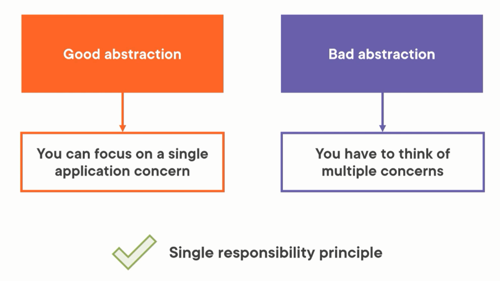
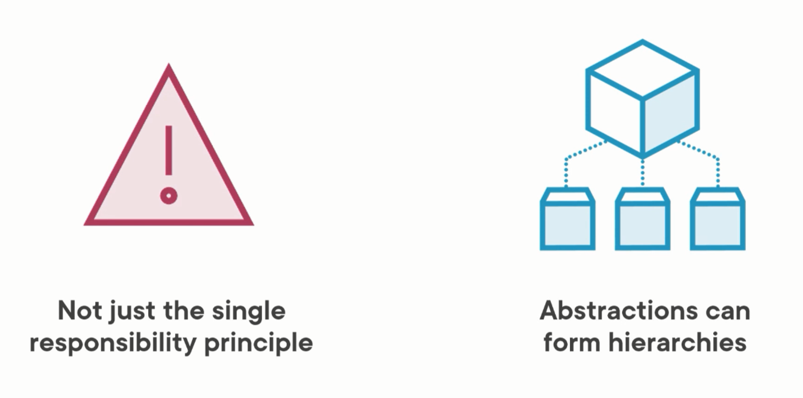
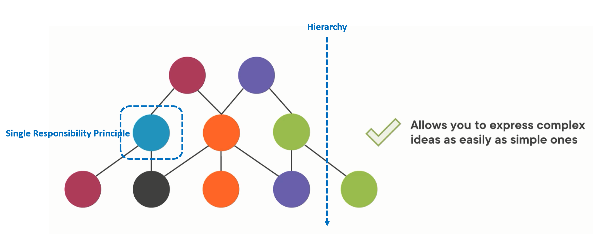
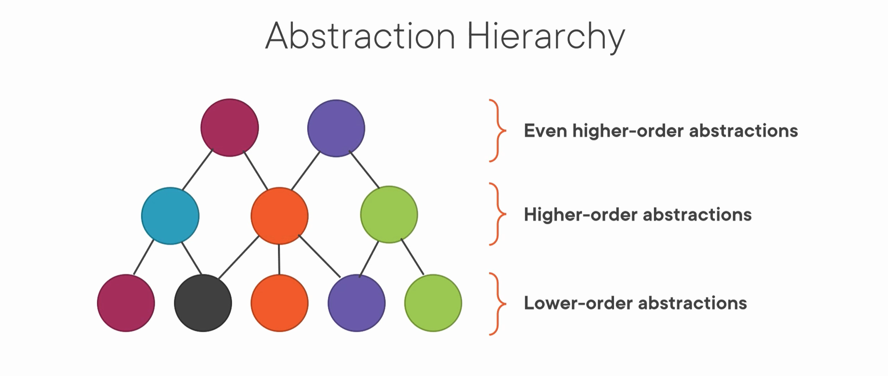
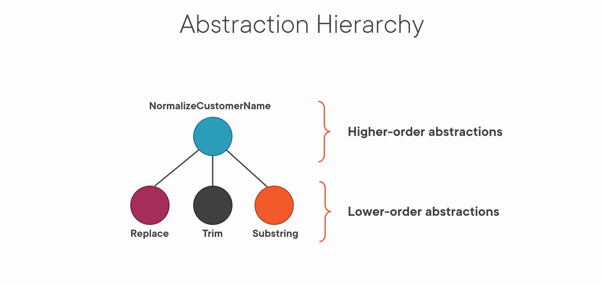
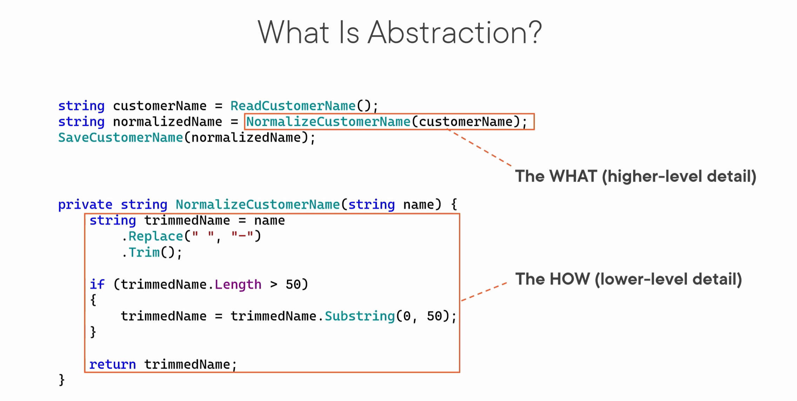

# 캡슐화와 추상화 이해하기

## 캡슐화(Encapsulation)
- 캡슐화 이유 : 캡슐화를 통해 Rich domain model을 정의할 수 있다.
  ```
  Encapsulation = Rich domain model
  ```
  - `TODO` Rich domain model
- 캡슐화 정의
  - **캡슐화는 데이터 무결성을 보호하는 행위입니다(Protecting data integrity).**
    - [데이터 무결성은 데이터를 보호하여 **항상 정상인 데이터를 유지하는 것**이다.](https://terms.naver.com/entry.naver?docId=826184&cid=42344&categoryId=42344)
    - [데이터 무결성은 **데이터에 대한 정확성, 일관성, 유효성, 신뢰성을 보장**하기 위해 데이터 변경 혹은 수정 시 여러가지 제한을 두어 **데이터의 정확성을 보증하는 것을 말한다.**](https://terms.naver.com/entry.naver?docId=2839810&cid=40942&categoryId=32840)
      - 데이터에 대한 정확성, 일관성, 유효성, 신뢰성을 보장한다 : **데이터를 보호한다.**
      - 데이터의 정확성을 보증하는 것을 말한다 : **항상 정상인 테이트를 유지하는 것이다.**
  - 용어 정의
    - `TODO` 정확성(Accuracy)
    - [일관성(Consistency)](https://terms.naver.com/entry.naver?docId=3431261&cid=58430&categoryId=58430)
      - 트랜잭션의 일관성(consistency)은 트랜잭션이 성공적으로 수행된 후에도 데이터베이스가 일관성 있는 상태를 유지해야 함을 의미한다. 즉, 트랜잭션이 수행되기 전에 데이터베이스가 일관된 상태였다면 트랜잭션의 수행이 완료된 후 결과를 반영한 데이터베이스도 또 다른 일관된 상태가 되어야 한다는 의미다.
    - `TODO` 유효성
    - `TODO` 신뢰성
- 캡슐화 기술 : 내부 데이터를 유효하지 않거나 일관성이 없는 상태로 설정할 수 없게 만드는 방법이다.
  - 정보은닉(Information hiding)  
    내부 데이터 손상을 최소화시킨다(Less risk of corrupting the class's internals).
  - 상태와 행위를 하나의 단위로 묶는 것(Bundling of data and operations)  
    클래스에서 수행할 수 있는 모든 작업에 대한 대한 단일 진입정을 제공한다(Perform integrity checks before modifying data).
  - 상태와 행위를 하나의 단위로 묶는 것(Bundling of data and operations) 예.
    - 잘못된 묶음 예 : manager인지 coder인지 결정(행위)을 Person 클래스가 하지 않는다.
      ```cs
      public class Person
      {
          public Employer Employer { get; set; }
          public string JobTitle { get; set; }
          public string City { get; set; }
      }

      public double GetManagerCoderRatio(IList<Person> persons)
      {
          int coders = persons.Count(person => person.JobTitle == "Programmer"
              || person.JobTitle == "Software Developer"
              || person.JobTitle == "Coder");

          int managers = persons.Count(person => person.JobTitle == "CTO"
              || person.JobTitle == "CFO"
              || person.JobTitle == "Manager");

          return managers / (double)coders;
      }
      ```
      - the method makes decisions based entirely upon the data of a single object.  
        메서드는 전적으로 단일 개체의 데이터를 기반으로 결정을 내 립니다.  
        Namely, it decides whether a person a manager or a coder.  
        즉, 사람이 관리자인지 코더인지를 결정합니다.  
        Clearly, such decisions should be made by the Person class itself.  
        분명히 이러한 결정은 Person 클래스 자체에서 내려야 합니다.
      - Person 클래스에서 manager와 coder을 결정해야 한다.
    - 올바른 묶음 예 : manager인지 coder인지 결정(행위)을 Person 클래스가 한다.
      ```cs
      public class Person
      {
          public Employer Employer { get; set; }
          public string JobTitle { get; set; }
          public string City { get; set; }

          public bool IsCoder
          {
              get
              {
                  return JobTitle == "Programmer"
                      || JobTitle == "Software Developer"
                      || JobTitle == "Coder";
              }
          }

          public bool IsManager
          {
              get
              {
                  return JobTitle == "CTO"
                      || JobTitle == "CFO"
                      || JobTitle == "Manager";
              }
          }
      }

      public double GetManagerCoderRatio(IList<Person> persons)
      {
          int coders = persons.Count(person => person.IsCoder);
          int managers = persons.Count(person => person.IsManager);
          return managers / (double)coders;
      }
      ```
- TODO 불변(비즈니스 규칙)
  - 클래스가 항상 참이어야하는 조건인 고유한 불변 집합이 있습니다. 준수하는 것은 개발자의 책임이다.
- 캡슐화 예.
   - 잘못된 캡슐화 예 : 비즈니스 규칙을 준수하지 못한다(3개보다 적거나 많은 모서리을 갖는 것으로부터 스스로 보호하지 못한다/캡슐화하지 못한다).
     ```cs
     // 불변성 : 삼각형은 모서리가 3개이다.
     public class Triangle
     {
     	public IEnumerable<Edge> Edges { get; }

        // 모서리 개수가 3개 미만 또는 3개 초가할 때도 Triangle 객체를 생성할 수 있다.
     	public Triangle(IEnumerable<Edge> edges)
     	{
     		Edges = edges;
     	}
     }

     var two = new Triangle(twoEdges);		// Line
     var four = new Triangle(fourEdges);	// Square
   - 올바른 캡슐화 예 : 비즈니스 규칙을 준수할 수 있다(3개보다 적거나 많은 모서리을 갖는 것으로부터 스스로 보호한다/캡슐화한다).
     ```cs
     // 불변성 : 삼각형은 모서리가 3개이다.
     public class Triangle
     {
     	public IEnumerable<Edge> Edges { get; }

        // 모서리 개수가 3개 미만 또는 3개 초가할 때는 Triangle 객체를 생성할 수 없다.
     	public Triangle(IEnumerable<Edge> edges)
     	{
            // Guard clause
     		if (edges.Count() != 3)
     			throw new Exception("Triangle must have 3 edges");

     		Edges = edges;
     	}
     }
     ```

## 추상화(Abstraction)
- 추상화 이유 : 복잡함을 관리하여 `코드를 단순화(Code Simplification)` 시킨다.
  - 구현 세부 사항을 자세히 살펴보지 않고도 **코드의 의도**를 이해할 수 있다.
    - 구현 세부 사항 : **관련 없는 것을 제거한다(the elimination of the irrelevant)**
    - 코드의 의도 : **분질적인 것을 증폭한다(the amplification of the essential)**
  - 복작함을 단순화게 표현할 수 있다(Allow you to express complex ideas as easily as simple ones).
- 추상화 정의
  ```
  Abstraction is
    the amplification of the essential(Single Responsibility Principle, Hierarchy)
    and
    the elimination of the irrelevant.

  Abstraction = Single Responsibility Principle + Hierarchy
  ```
  - 분질적인 것을 증폭하고 관련 없는 것을 제거하는 것이다(Abstraction is the amplification of the essential and the elimination of the irrelevant).
    - 분질적인 것을 증폭한다(the amplification of the essential) : the current task(SRP 원칙)  
      당면한 작업에만 집중할 수 있도록 만든다(이해할 코드 범위를 줄인다 : 코드 복잡도를 줄인다).  
    - 관련 없는 것을 제거한다(the elimination of the irrelevant) : all other tasks
  - `Not just the Single Responsibility Principle`
    
    - 좋은 추상화 : `You can focus on a single application concern`  
      단 한가지 관심사에만 집중할 수 있다.
    - 나쁜 추상화 : `You have to think of multiple concerns`  
      한번에 많은 관심사에 집중해야 하기 때문에 메서드나 클래스가 무엇을 하는지 알기가 쉽지 않다.
  - `Abstraction can form hierarchies`
    
  - `단 한가지 관심사 기준으로 계층화(구조화)할 수 있다.`
    
- 추상화 기술
  - ~~`abstract class`~~ 추상 클래스는 추상화 기술이 아니다.
  - ~~`interface`~~ 인터페이스는 추상화 기술이 아니다.
  - `Single Responsibility Principle` : 단 한가지 관심사 기준으로 **새 메서드와 새 클래스**을 만든다.
  - `Hierarchy` : 단 한가지 관심사 기준으로 **계층 관계**를 정의한다.
    
- 추상화 리팩토링 예 : 단 한가지 관심사를 갖는 새 메서드 만들기
  - 리팩토링 전 : 고객 이름 정규화 방법이 공개되어 있다.
    ```cs
    string trimmedName = customerName
    	.Replace(" ", "-")
    	.Trim();

    if (trimmedName.Length > 50)
    {
    	trimmedName = trimmedName.Substring(0, 50);
    }
    ```
  - 리팩토링 후 :
    - `Amplifies the essential`
      - 고객 이름 정규화 `사실(WHAT)만` 알린다(`NormalizeCustomerName`).
      - NormalizeCustomerName `메서드 이름`
    - `Eliminates the irrelevant`
      - 고객 이름 정규화 `방법이(HOW)이` 비공개되어 있다.
      - NormalizeCustomerName `메서드 구현`
    ```cs
    // 고객 이름 정규화 사실 : NormalizeCustomerName 메서드 이름
    string normalizedName = NormalizeCustomerName(customerName);

    // 고객 이름 정규화 방법 : NormalizeCustomerName 메서드 구현
    private string NormalizeCustomerName(string name)
    {
    	string trimmedName = name
    		.Replace(" ", "-")
    		.Trim();
    	if (trimmedName.Length > 50)
    	{
    		trimmedName = trimmedName.Substring(0, 50);
    	}
    	return trimmedName;
    }
    ```
    - 분질적인 것을 증폭한다(the amplification of the essential) : 메서드 이름으로 비즈니스(이름 정규화 사실 : WHAT)만 표현한다.
    - 관련 없는 것을 제거한다(the elimination of the irrelevant) : 메서드로 비즈니스 규칙(이름 정규화 규칙 : HOW)을 감춘다.
      
    
- 추상화 코드
  - 모든 코드가 추상화다(All code is abstraction).

## 캡슐화 vs. 추상화 비교


## 참고 자료
- [x] [Encapsulating EF Core 6 Usage | Understanding Encapsulation and Abstraction](https://www.pluralsight.com/courses/ef-core-6-encapsulating-usage)
- [ ] [Encapsulation revisited](https://enterprisecraftsmanship.com/posts/encapsulation-revisited/)
- [ ] [TellDontAsk](https://martinfowler.com/bliki/TellDontAsk.html)
- [ ] [Tell, don't ask 원칙(TDA 원칙)](https://effectiveprogramming.tistory.com/entry/Tell-dont-ask?category=660012)
- [ ] [The Tell Don’t Ask Principle Explained](https://danparkin.com/2018/09/18/tell-dont-ask/)
- [ ] [Law of Demeter and immutability](https://enterprisecraftsmanship.com/posts/law-of-demeter-and-immutability/)